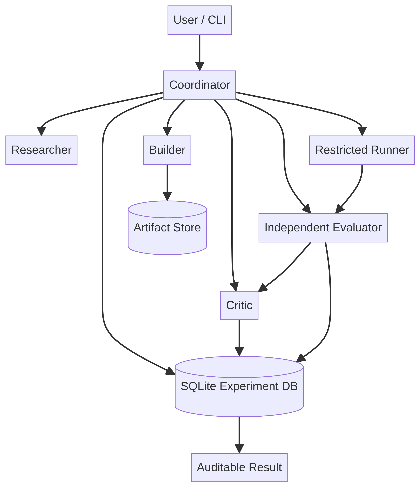
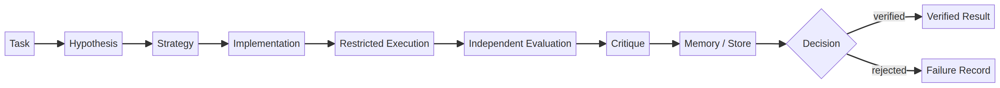
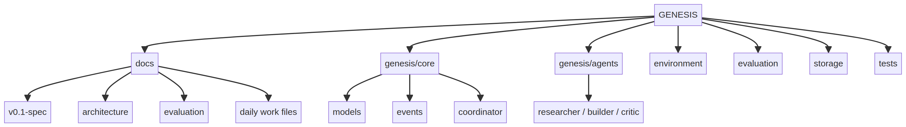
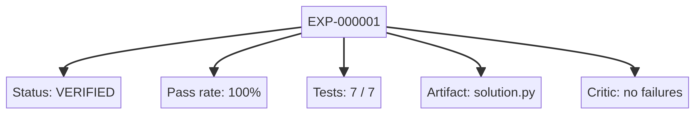

# GENESIS

> **A reproducible, local-first framework for measurable multi-agent AI experiments.**

GENESIS is an open-source research framework for studying whether structured collaboration between specialized AI roles can produce better problem-solving workflows under independent evaluation.

It is intentionally not marketed as AGI, consciousness, or unrestricted autonomous intelligence. The project starts with a smaller and testable question:

> **Can an AI workflow propose, build, test, critique, remember, and compare solutions while preserving enough evidence to explain why one strategy was accepted?**



## Why GENESIS exists

Many multi-agent demos show several models talking to one another and then call the conversation progress. GENESIS uses a stricter standard. A conversation is only a proposal layer. The important object is the **experiment**: a versioned task, strategy, artifact, execution, evaluation, critique, and decision that another person can inspect.

The project therefore treats every claimed improvement as a scientific claim. It must be compared with a frozen baseline, measured under the same conditions, evaluated independently, and preserved together with failures and resource usage.

## Current status

The repository currently contains a runnable **v0.1 development core**:

| Capability | Current state |
|---|---|
| Typed task, strategy, budget, artifact, metric, and experiment models | Implemented |
| Strict experiment lifecycle and domain events | Implemented |
| Offline deterministic model provider | Implemented |
| SQLite experiment database | Implemented |
| Content-addressed artifact references | Implemented |
| Restricted local Python runner with timeouts | Implemented |
| Independent benchmark evaluator | Implemented |
| Researcher, Builder, and Critic roles | Implemented |
| End-to-end Coordinator | Implemented |
| CLI commands | Implemented |
| Local GitHub-style dashboard | Implemented |
| Included local Hugging Face checkpoint and provider | Implemented as an optional integration |
| Strategy evolution and dynamic roles | Deferred until the baseline is scientifically measured |

The current example is deliberately deterministic. It establishes a reproducible baseline before external model variability is introduced.

## The complete workflow



The runtime sequence is:

1. A `Task` defines the problem and benchmark version.
2. A `Strategy` defines the workflow used to solve it.
3. The `Researcher` produces a structured hypothesis and plan.
4. The `Builder` produces an artifact.
5. The artifact is executed in a bounded local runner.
6. The independent evaluator runs the benchmark cases outside the builder's control.
7. The `Critic` analyzes failures without deciding the score.
8. SQLite stores the experiment, events, metrics, and status history.
9. GENESIS records a terminal decision such as `verified`, `rejected`, `failed`, or `budget_exceeded`.



## A first experiment

The included example task is `python-sum-squares-v1`.

### Input

The candidate program receives a JSON integer through standard input:

```json
7
```

The task asks it to print the sum of squares from `1` through `n`, also as JSON:

```json
140
```

The benchmark contains development, validation, and hidden cases. The initial deterministic baseline is evaluated on seven cases.

### Output

A successful run produces a structured report similar to:

```json
{
  "status": "verified",
  "score": 1.0,
  "passed": 7,
  "total": 7,
  "critique": {
    "failure_count": 0,
    "summary": "No failures detected."
  },
  "artifact": "solution.py"
}
```



This result means that the current baseline passed the current example benchmark. It does **not** mean that the system became generally intelligent or that a model improved itself. The next scientific comparison is a model-backed candidate against this frozen baseline under equal budgets.

See the full example in [`docs/example-result.md`](docs/example-result.md).

## Quick start

GENESIS is designed to work offline for its first run.

```bash
git clone https://github.com/osamahdesk/GENESIS.git
cd GENESIS
python3 -m venv .venv
source .venv/bin/activate
pip install -e ".[dev]"
```

Initialize the local workspace:

```bash
genesis init
```

Run the complete offline baseline experiment:

```bash
genesis run
```

Inspect stored experiments:

```bash
genesis status
```

Inspect a specific experiment:

```bash
genesis experiment EXP-000001
```

## The local dashboard

The CLI is the primary interface for automation and reproducibility. The dashboard is a lightweight visual layer for humans who want a simpler overview.

Run an experiment first, then start the dashboard:

```bash
genesis run
genesis dashboard
```

Open:

```text
http://127.0.0.1:8765
```

The dashboard shows the latest status, score, test count, workflow, experiment identity, evidence snapshot, and a short hint explaining the next action. Highlighted cards and workflow steps are clickable: a small teaching bubble explains what the selected element means and how it connects to the experiment. A Permission Center makes the deny-by-default boundary visible. It uses the same local SQLite records as the CLI and does not require an external service.

## Design principles

### Evidence over conversation

An agent's explanation is a hypothesis. A measured evaluation is evidence. The evaluator is independent from the artifact-generation role.

### Reproducibility by default

Experiments preserve task identity, strategy identity, artifact hashes, status events, model metadata, configuration, metrics, and timestamps. Future releases will export a complete experiment bundle.

### Safe defaults

The default mode is offline. Network access is not silently enabled. Generated code runs in a bounded temporary workspace with a timeout and a sanitized environment. This reduces risk but is not a perfect security boundary; users must not execute untrusted code with permissions they would not grant to an unknown program.

### Provider independence

The core domain models do not depend on OpenAI, Anthropic, Hugging Face, or any single vendor. Provider adapters are deliberately separated from tasks, experiments, evaluation, storage, and orchestration.

### Small increments

GENESIS is developed one daily work file at a time. Each file defines its scope, acceptance criteria, tests, blockers, and final status. Later features are not silently pulled into an earlier day.

## Repository structure

```text
GENESIS/
├── README.md
├── pyproject.toml
├── configs/
│   └── default.yaml
├── docs/
│   ├── vision.md
│   ├── v0.1-spec.md
│   ├── architecture.md
│   ├── evaluation.md
│   ├── security.md
│   ├── roadmap.md
│   ├── work-tree.md
│   ├── example-result.md
│   ├── images/
│   └── daily/
├── genesis/
│   ├── agents/
│   ├── core/
│   ├── environment/
│   ├── evaluation/
│   ├── providers/
│   ├── storage/
│   └── ui/
├── benchmarks/
├── examples/
└── tests/
```

## Architecture overview

The Coordinator is the boundary between user intent and experiment execution. It invokes specialized roles, applies the lifecycle state machine, records domain events, and delegates scoring to the independent evaluator.

The safety boundary is intentionally outside the parts that future evolution may modify. A later strategy or role candidate may be tested in an isolated experiment, but it cannot silently replace the evaluator, hidden-test policy, approval mechanism, or host permissions.

## Evaluation policy

A fair comparison uses the same task set, model, model parameters, retry rules, time budget, execution policy, and output format for the baseline and candidate. A single run is not enough to establish a scientific improvement. Future reports will support repeated trials, spread, cost, latency, hidden-task performance, and ablation studies.

The intended baseline ladder is:

```text
Single model → Single model + self-critique
             → Researcher + Builder
             → Researcher + Builder + Critic + Repair
```

The purpose is to measure which component contributes to an observed change rather than assuming that more agents automatically means better performance.

## Roadmap

The approved roadmap is phased:

- **Foundation:** schemas, events, configuration, providers, and storage.
- **First experiment:** evaluator, runner, roles, Coordinator, and CLI.
- **Scientific integrity:** hidden splits, repetitions, cost metrics, anti-cheating checks, and reproducibility bundles.
- **Strategy evolution:** frozen parents, mutation, selection, failure memory, and regression gates.
- **Future research:** dynamic roles, tool experiments, capability-gap analysis, and carefully controlled external research.

The detailed sequence is in [`docs/roadmap.md`](docs/roadmap.md), and each day is tracked in [`docs/daily/day-index.md`](docs/daily/day-index.md).

## Tests

Install development dependencies and run:

```bash
python -m pytest
```

The current development core includes unit, lifecycle, evaluation, end-to-end, and dashboard tests. A clean test run is a release requirement, not an optional polish step.

## Hugging Face integration

Phase 2 includes the small [`sshleifer/tiny-gpt2`](models/sshleifer-tiny-gpt2) checkpoint from Hugging Face. The files are committed with a `SHA256SUMS` manifest, and [`HuggingFaceLocalProvider`](genesis/providers/huggingface_local.py) loads them from disk through the same provider boundary used by the mock provider.

The integration is optional because PyTorch and Transformers are heavyweight dependencies compared with the deterministic core. Install it only when you want to run the local model:

```bash
pip install -e '.[hf]'
```

The default test suite and offline baseline still work without the `hf` extra. This separation lets GENESIS use a real model while preserving clean, fast, reproducible development for the rest of the project. The model is intentionally a tiny integration checkpoint, not a claim of production-quality generation.

## Contributing

Start by reading [`docs/v0.1-spec.md`](docs/v0.1-spec.md), then choose the next incomplete daily work file. Keep changes small, add tests, preserve the offline path, and document any architecture change. Do not publish claims of improvement without the benchmark evidence that supports them.

## License

MIT. See [`LICENSE`](LICENSE).
